# Workshop de Git Workflow para Dois Programadores 💻 💻

<!-- ***********************************************************-->
## Resumo do Workshop

Um exercício para praticar habilidades de workflow com git. O workshop deve ser realizado por dois programadores, cada um em seu computador. As habilidades praticadas incluem:

- clonar um repositório
- criar branches
- alternar entre branches
- adicionar alterações à área de staging
- fazer commits
- puxar a versão mais recente do branch master remoto
- mesclar o branch master com um branch recém-criado
- resolver conflitos de mesclagem
- enviar alterações para o repositório remoto
- criar um pull request no GitHub
- mesclar um pull request no GitHub

<!-- ***********************************************************-->
# Configuração inicial :rocket:

Vocês estão trabalhando em equipe em um projeto para um novo cliente. Os passos 1 a 8 desta seção devem ser realizados por um de vocês, que chamaremos de `Programador 1`.

## Passo 1 - O Programador 1 cria um novo repositório no GitHub e o clona

1. Vá para a organização do GitHub da sua turma e crie um novo repositório, inicializando-o com um `README.md`.

2. [Clone](https://help.github.com/articles/cloning-a-repository/) este novo repositório usando o terminal.

   

   ```sh
   $ git clone 'COLE AQUI A URL DO SEU REPOSITÓRIO'
   ```

3. Acesse o diretório recém-criado.

   ```sh
   $ cd nome-do-seu-repo-aqui
   ```
Este é o visual dos repositórios remoto e local após esse passo. HEAD é uma referência à sua localização atual.</br>
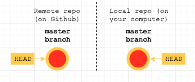

<!-- ***********************************************************-->
## Passo 2 - Abra issues sobre o trabalho a ser feito

Normalmente, vocês decidiriam quais "features" serão desenvolvidas e depois as dividiriam em issues menores antes de começar a trabalhar.

Para o propósito deste exercício, vamos apenas [adicionar uma issue](https://help.github.com/articles/creating-an-issue/) no momento. O cliente quer um título lindamente estilizado para a página inicial. Deve ser uma escrita simples, em negrito, preta, com uma sombra de fundo que a destaque.

1. Crie uma nova issue com um título descritivo.

2. No corpo da issue, forneça mais detalhes sobre como concluir o trabalho.

3. Atribuam essa issue a vocês mesmos.

<!-- ***********************************************************-->
## Passo 3 - Crie e mude para um novo branch

Existem muitos tipos de workflow. No FAC, usamos [o fluxo GitHub](https://guides.github.com/introduction/flow/), onde o branch `master` [branch](https://help.github.com/articles/about-branches/) é sempre implantável. Nesse fluxo, cada branch é usado para um recurso separado.

1. Crie um branch com um nome único e descritivo. Por exemplo, `create-heading-with-shadow`.

   ```sh
   $ git branch create-heading-with-shadow
   ```
   </br>
   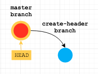
2. Saia do branch master mudando para o novo branch que você acabou de criar.

   ```sh
   $ git checkout create-heading-with-shadow
   ```
   </br>
   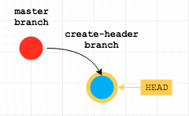

<!-- ***********************************************************-->
## Passo 4 - Escreva HTML e CSS suficientes para atender aos requisitos

1. Adicione o seguinte código em um arquivo chamado `index.html`.

    ```html
    <!DOCTYPE html>
    <html lang="en">

    <head>
        <meta charset="UTF-8">
        <meta name="viewport" content="width=device-width, initial-scale=1.0">
        <link rel="stylesheet" href="style.css">
        <title>Git Workflow Workshop</title>
    </head>

    <body>

        <h1 class="some-heading">GIT WORKFLOW WORKSHOW</h1>

    </body>

    </html>
    ```

2. Crie um novo arquivo chamado `style.css` contendo:

    ```css
    * {
      margin: 0;
      padding: 0;
    }

    .page-heading {
      box-sizing: border-box;
      font-family: "Avant Garde", Avantgarde, "Century Gothic", CenturyGothic, "AppleGothic", sans-serif;
      font-size: 3.5rem;
      padding: 5rem 3rem;
      text-align: center;
      text-rendering: optimizeLegibility;
      color: #131313;
      background-color: #e7e5e4;
      letter-spacing: .15em;
      text-shadow: 1px -1px 0 #767676, -1px 2px 1px #737272, -2px 4px 1px #767474, -3px 6px 1px #787777, -4px 8px 1px #7b7a7a, -5px 10px 1px #7f7d7d, -6px 12px 1px #828181, -7px 14px 1px #868585, -8px 16px 1px #8b8a89, -9px 18px 1px #8f8e8d, -10px 20px 1px #949392, -11px 22px 1px #999897, -12px 24px 1px #9e9c9c, -13px 26px 1px #a3a1a1, -14px 28px 1px #a8a6a6, -15px 30px 1px #adabab, -16px 32px 1px #b2b1b0, -17px 34px 1px #b7b6b5, -18px 36px 1px #bcbbba, -19px 38px 1px #c1bfbf, -20px 40px 1px #c6c4c4, -21px 42px 1px #cbc9c8, -22px 44px 1px #cfcdcd, -23px 46px 1px #d4d2d1, -24px 48px 1px #d8d6d5, -25px 50px 1px #dbdad9, -26px 52px 1px #dfdddc, -27px 54px 1px #e2e0df, -28px 56px 1px #e4e3e2;
    }
    ```

<!-- ***********************************************************-->
## Passo 5 - Adicione os novos arquivos à área de staging

1. Adicione `index.html` e `style.css` à [área de staging](http://softwareengineering.stackexchange.com/questions/119782/what-does-stage-mean-in-git).

    ```sh
    $ git add index.html style.css
    ```
    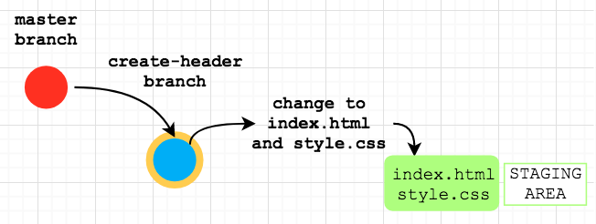

<!-- ***********************************************************-->
## Passo 6 - Faça commit das suas alterações

O histórico de um projeto é composto por ["commits"](https://stackoverflow.com/questions/2745076/what-are-the-differences-between-git-commit-and-git-push). Cada commit é uma captura instantânea de todo o repositório em um determinado momento.

1. Faça commit dos arquivos que estão na área de staging.

   Antes de fechar a mensagem de commit com aspas, você pode pressionar Enter no teclado para continuar digitando na nova linha do terminal. O texto na segunda linha pode ser usado como uma mensagem adicional.

   É uma boa prática vincular seu commit a uma issue existente digitando `Relates #1`. Graças ao uso do símbolo de hash seguido pelo número da issue relevante, seu commit será [automaticamente vinculado a uma issue existente](https://help.github.com/articles/autolinked-references-and-urls/).

    ```sh
    $ git commit -m 'add git workshop heading & shadow styling
    > Relates #1'
    ```
    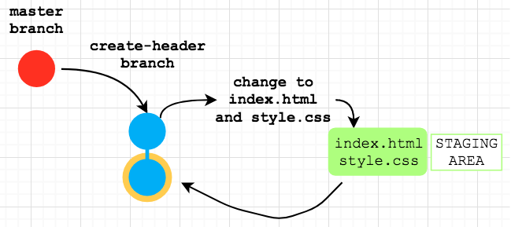

<!-- ***********************************************************-->
## Etapa 7 - Ambos os programadores fazem commit de suas alterações
1. Ambos os programadores fazem commit das alterações. Não se esqueça da mensagem de commit multilinha com a referência ao problema.

  ```sh
  # Programador 1:
  $ git commit -m 'Corrigir erro de digitação no título da página
  > Relacionado ao problema #<número do problema>'

  # Programador 2:
  $ git commit -m 'Atualizar nome da classe no título
  > Relacionado ao problema #<número do problema>'
  ```

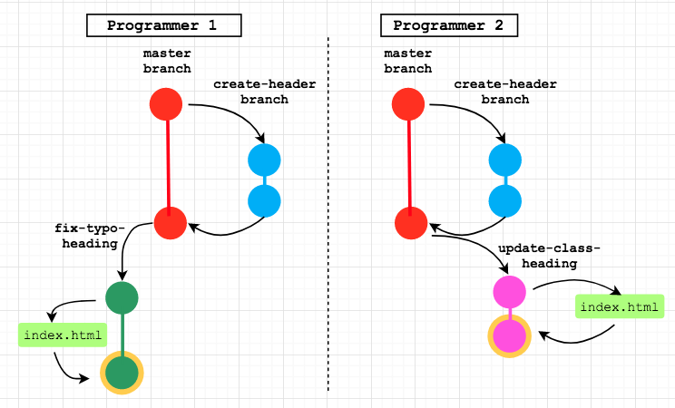

<!-- ***********************************************************-->
## Etapa 8 - Programador 1 muda para a branch `master` e faz o pull da branch `master` remota
Agora temos tantos programadores trabalhando neste projeto que quem sabe quais mudanças podem ter ocorrido na branch `master` desde a última vez que olhamos a versão remota que está no GitHub?

1. O programador 1 muda para a branch `master`.

  ```sh
  $ git checkout master
  ```

2. O programador 1 [faz o pull](https://git-scm.com/docs/git-pull) da branch `master` do repositório remoto (GitHub) para garantir que a versão local da `master` esteja atualizada com a versão remota (GitHub) da `master`. (Não deve haver mudanças, já que nenhum de vocês enviou alterações para o repositório remoto ainda.) **É uma boa prática verificar regularmente se há mudanças na versão remota antes de enviar suas alterações locais.**

  ```sh
  $ git pull origin master
  ```

3. O programador 1 muda de volta para a branch `fix-typo-heading`.

  ```sh
  $ git checkout fix-typo-heading
  ```


<!-- ***********************************************************-->
## Etapa 9 - Programador 1 faz push da branch `fix-typo-heading` para o repositório remoto

1. O programador 1 [faz push](https://help.github.com/articles/pushing-to-a-remote/) da branch `fix-typo-heading` para o repositório remoto.

  ```sh
  $ git push origin fix-typo-heading
  ```

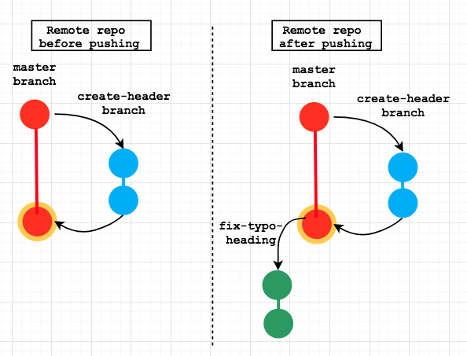

<!-- ***********************************************************-->
## Etapa 10 - Programador 1 cria um pull request

1. O programador 1 navega até o repositório no GitHub.com e cria um [pull request](https://help.github.com/articles/creating-a-pull-request/#creating-the-pull-request).

    + Adicione um título descritivo (por exemplo, `Corrigir erro de digitação no título da página`) e deixe um comentário vinculando o pull request ao problema.

    + Selecione o Programador 2 como [responsável](https://help.github.com/articles/assigning-issues-and-pull-requests-to-other-github-users/).

    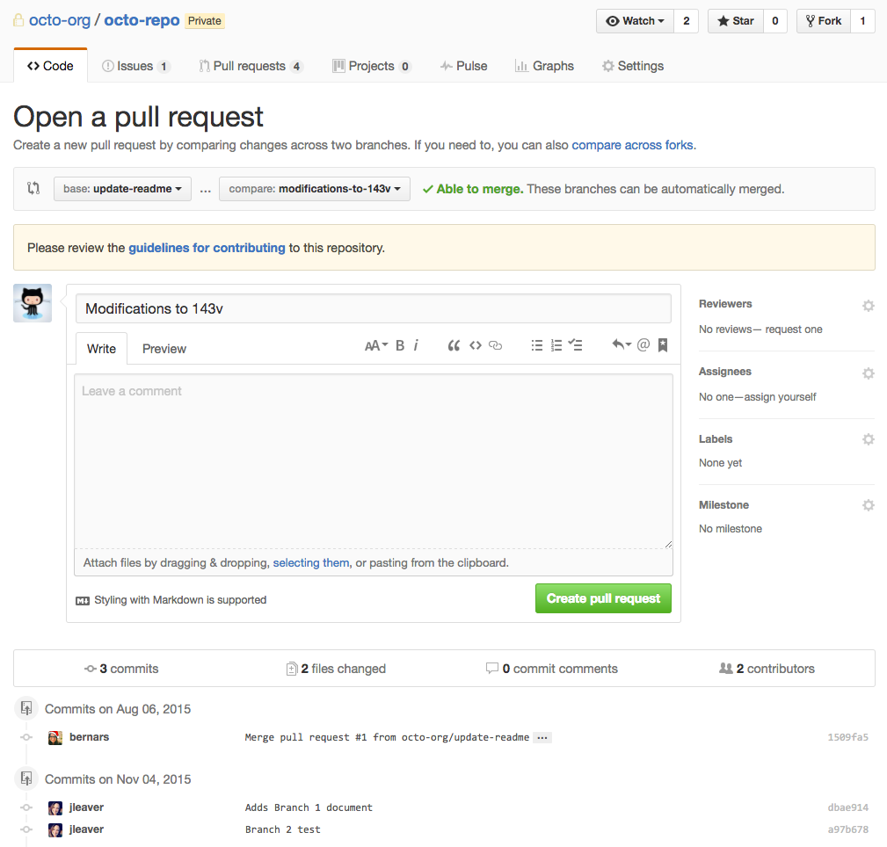


<!-- ***********************************************************-->
## Etapa 11 - Programador 2 revisa o pull request

O Programador 2 [revisa o pull request](https://help.github.com/articles/about-pull-request-reviews/).

1. Passe por cada commit (neste caso, apenas um).

2. Verifique a aba "Files changed" para uma análise linha a linha das mudanças.

3. Clique em "Review changes" e escolha:
    + "Comment"
    + "Approve"
    + "Request changes"


<!-- ***********************************************************-->
## Etapa 12 - Programador 2 faz o merge do pull request :+1:

1. O programador 2 [faz o merge do pull request](https://help.github.com/articles/merging-a-pull-request/#merging-a-pull-request-on-github) no GitHub.com.

  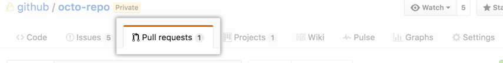

2. O programador 2 abre o site ao vivo no GitHub Pages para verificar se o erro de digitação foi corrigido. Vá para as configurações do repositório no GitHub, role para baixo até encontrar o título do GitHub Pages. Selecione a branch master como fonte e salve; em seguida, você verá a URL onde o site ao vivo está disponível. 

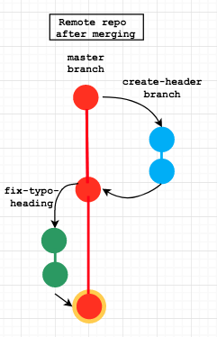


<!-- ***********************************************************-->
## Etapa 13 - Programador 2 muda para a branch `master`, faz o pull da branch `master` remota, tenta fazer o merge dela na branch `update-class-heading` e :collision: resolve conflitos de merge :collision:

1. O programador 2 muda para a branch `master`.

  ```sh
  $ git checkout master
  ```

2. O programador 2 [faz o pull](https://git-scm.com/docs/git-pull) da branch `master` remota para garantir que a versão mais recente do projeto esteja disponível localmente.

  ```sh
  $ git pull origin master
  ```

  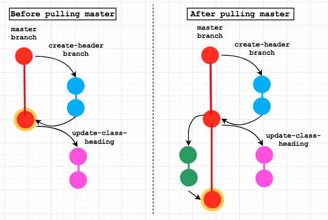

3. O programador 2 muda de volta para a branch `update-class-heading`.

  ```sh
  $ git checkout update-class-heading
  ```

4. O programador 2 tenta fazer o merge da branch `master` na branch `update-class-heading`.

  ```sh
  $ git merge master
  ```

5. Deve haver um :collision: conflito de merge :collision: já que a linha com o título `<h1>` é diferente. [O conflito de merge deve ser destacado com marcadores HEAD e master](http://stackoverflow.com/questions/7901864/git-conflict-markers) como segue:

  ```html
  <body>

  <<<<<<< HEAD
      <h1 class="page-heading">GIT WORKFLOW WORKSHOW</h1>
  =======
      <h1 class="some-heading">GIT WORKFLOW WORKSHOP</h1>
  >>>>>>> master

  </body>
  ```

6. O programador 2 remove os marcadores HEAD e master e deixa apenas uma linha com o título `<h1>` para que ambos os problemas sejam resolvidos.

  ```html
  <body>

      <h1 class="page-heading">GIT WORKFLOW WORKSHOP</h1>

  </body>
  ```

7. O programador 2 adiciona o arquivo `index.html` à área de stage e faz commit das alterações ocorridas durante o conflito de merge.

  ```sh
  # Primeiro, adicione à área de stage
  $ git add index.html

  # Depois, faça o commit das mudanças
  $ git commit -m 'Corrigir conflito de merge
  > Relacionado aos problemas #<número do problema> e #<número do problema>'
  ```

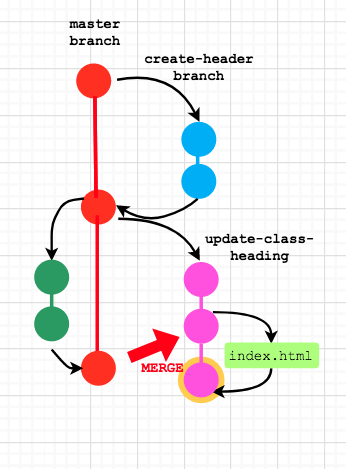

<!-- ***********************************************************-->
## Etapa 14 - Programador 2 faz push da branch `update-class-heading` para o repositório remoto

1. O programador 2 [faz push](https://help.github.com/articles/pushing-to-a-remote/) da branch `update-class-heading` para o repositório remoto.

  ```sh
    $ git push origin update-class-heading
  ```

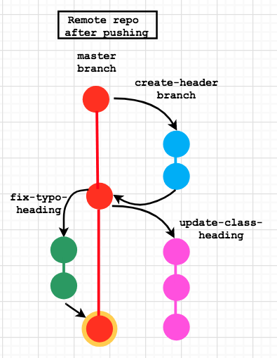


<!-- ***********************************************************-->
## Etapa 15 - Programador 2 cria um pull request

1. O programador 2 navega até o repositório no GitHub.com e cria um [pull request](https://help.github.com/articles/creating-a-pull-request/#creating-the-pull-request) selecionando `master` como branch base e `update-class-heading` como branch de origem. Adicione um título descritivo (por exemplo, `Atualizar nome da classe no título da página`) e deixe um comentário vinculando o pull request ao problema `#<número>`. Por favor, selecione também o Programador 1 como [responsável](https://help.github.com/articles/assigning-issues-and-pull-requests-to-other-github-users/).


Aqui está a tradução formatada em Markdown:

<!-- ***********************************************************-->
## Etapa 16 - Programador 1 faz o merge da pull request :+1:

1. O Programador 1 revisa e [faz o merge da pull request](https://help.github.com/articles/merging-a-pull-request/#merging-a-pull-request-on-github) no GitHub.com.

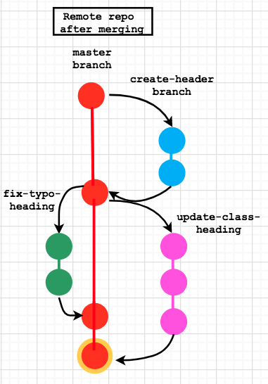

2. O Programador 1 abre o site ao vivo no GitHub Pages para verificar o novo estilo do cabeçalho.

  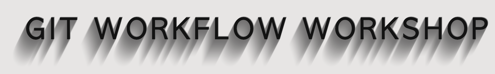


<!-- ***********************************************************-->
## É isso 😄 Obrigado por conferir o 'Workshop de Fluxo Git para Dois Programadores' :clap:  

***Um resumo dos comandos acima e o que eles fazem pode ser encontrado [aqui](/images/git-flow-summary-table.png) em uma tabela bem organizada.***

**Nota**: Este workshop não aborda a ideia muito popular de fazer um fork de um repositório, que é muito útil quando se deseja contribuir para projetos open source existentes 💯. Fazer um fork não é necessário ao iniciar um novo repositório nas organizações `foundersandcoders` ou `FAC-X`, pois todos os seus colegas de classe serão automaticamente adicionados como colaboradores.

Dito isso, recomendamos que você leia sobre forks para poder contribuir com projetos open source. Você pode ler mais sobre isso [aqui](https://help.github.com/en/articles/fork-a-repo).